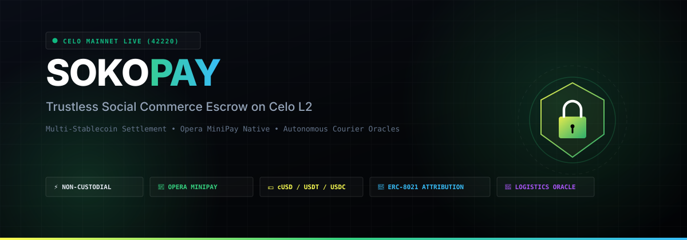
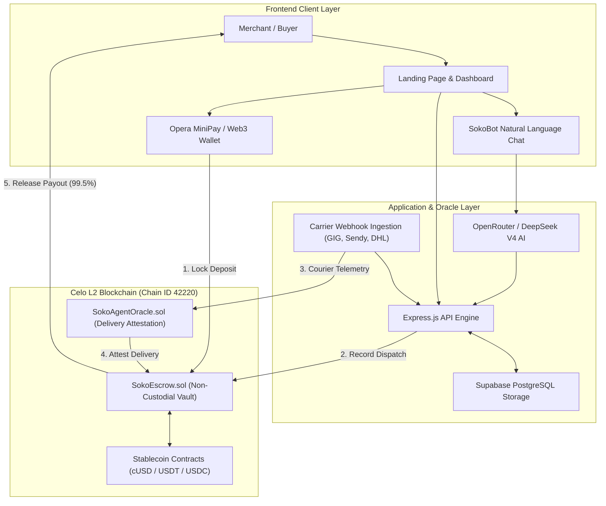

# SokoPay



<div align="center">

[](https://celoscan.io/address/0x8689F95860A33611bCa3A8AEd41Cc501298727AF)
[](https://minipay.opera.com/)
[](https://celobuilders.xyz)
[](https://vercel.com)
[](https://opensource.org/licenses/MIT)

**Trustless Social Commerce Escrow on Celo L2 for Opera MiniPay, WhatsApp, Instagram & Telegram Merchants**

[Live Application](https://sokopay.xyz) • [Smart Contracts](#-deployed-smart-contracts) • [Architecture](#-system-architecture) • [Vercel Deployment](#-deploying-on-vercel) • [API Reference](#-api-reference)

</div>

---

## 📌 Executive Summary

Over **80% of independent online retail across emerging markets** (Nigeria, Kenya, Ghana, South Africa, and Latin America) takes place over informal social channels: **WhatsApp groups, Instagram DMs, and Telegram channels**.

This ecosystem suffers from severe counterparty risk:
- **Buyers** fear paying upfront before receiving the package ("pay before delivery" scams).
- **Sellers** refuse "cash on delivery" due to high rejection rates, return courier fees, and counterfeit bills.
- **Traditional Escrow Services** charge exorbitant 3% to 8% fees and require complex bank documentation.

**SokoPay eliminates this deadlock.** Powered by Celo's sub-second L2 architecture, non-custodial smart contracts, and real-time courier telemetry oracles, SokoPay creates an automated, decentralized settlement layer where:
1. **Buyers** lock stablecoins (`cUSD`, `USDT`, `USDC`) safely into an immutable escrow smart contract via **Opera MiniPay** or any Web3 wallet.
2. **Sellers** dispatch goods through verified regional logistics carriers (GIG Logistics, Sendy, DHL).
3. **Logistics Oracles** cryptographically attest physical parcel delivery upon recipient signature.
4. **Escrow Contracts** automatically release 99.5% payout to the merchant within 500 milliseconds (transparent 0.5% protocol fee).

---

## 🚀 Deployed Smart Contracts

SokoPay is deployed on **Celo Mainnet (Chain ID: `42220`)** and **Celo Sepolia Testnet (Chain ID: `11142220`)**.

| Contract | Network | Address | Explorer Link |
| :--- | :--- | :--- | :--- |
| **SokoEscrow** | **Celo Mainnet** | `0x8689F95860A33611bCa3A8AEd41Cc501298727AF` | [View on Celoscan](https://celoscan.io/address/0x8689F95860A33611bCa3A8AEd41Cc501298727AF) |
| **SokoAgentOracle** | **Celo Mainnet** | `0x99ac8364da2D532045e44958c9D8820C621C496a` | [View on Celoscan](https://celoscan.io/address/0x99ac8364da2D532045e44958c9D8820C621C496a) |
| **Deployer / Admin** | **Celo Mainnet** | `0xB805EFCDA00ae07df354cF84566784CC1CbAd5eF` | [View on Celoscan](https://celoscan.io/address/0xB805EFCDA00ae07df354cF84566784CC1CbAd5eF) |
| **SokoEscrow** | Celo Sepolia | `0xCf7Ed3AccA5a467e9e704C703E8D87F634fB0Fc9` | [View on Blockscout](https://celo-sepolia.blockscout.com/address/0xCf7Ed3AccA5a467e9e704C703E8D87F634fB0Fc9) |

### Supported Native Stablecoins on Celo Mainnet

| Currency | Symbol | Decimals | Mainnet Contract Address |
| :--- | :--- | :--- | :--- |
| **Celo Dollar** | `cUSD` | 18 | `0x765DE816845861e75A25fCA122bb6898B8B1282a` |
| **Tether USD** | `USDT` | 6 | `0x48065fbBE25f71C9282ddf5e1cD6D6A887483D5e` |
| **USD Coin** | `USDC` | 6 | `0xcebA9300f2b948710d2653dD7B07f33A8B32118C` |
| **Celo Euro** | `cEUR` | 18 | `0xD8763CBa276a3738E6DE85b4431A44402948f099` |

### Ecosystem Attribution (ERC-8021)
All onchain transactions deployed through SokoPay automatically append the standardized ERC-8021 calldata suffix:
```text
celo_sokopay1234
```
This enables transparent onchain analytics, ecosystem attribution, and decentralized volume verification.

---

## ⚡ Key Features

- 📱 **Opera MiniPay Native Integration**  
  Built from the ground up for seamless compatibility with Opera MiniPay. Over 100M mobile users in Africa can connect natively using their phone-backed smart wallet with zero gas friction.

- 💵 **Multi-Stablecoin Support**  
  Transact in native `cUSD`, `USDT`, `USDC`, and `cEUR` with automatic decimal normalization (18 decimals for Mento tokens, 6 decimals for ERC-20 stablecoins).

- 🚚 **Autonomous Carrier Oracles (`SokoAgentOracle.sol`)**  
  Real-world logistics webhooks (GIG Logistics, Sendy, DHL, FedEx) feed into autonomous oracles that attest parcel milestones. When a parcel is marked `DELIVERED` with signature verification, the oracle triggers instant escrow release.

- 🤖 **SokoBot Conversational Commerce Agent**  
  Integrated AI agent powered by DeepSeek V4 Flash via OpenRouter. Merchants can generate binding onchain invoices by typing natural language prompts like:
  > *"Invoice @amina 45 cUSD for Vintage Leather Jacket with 3 days delivery"*

- 🛡️ **Non-Custodial Smart Escrow with Auto-Release Guarantee**  
  Funds never touch centralized servers. If a buyer becomes unresponsive after receiving a package, the seller can trigger `autoRelease` once the delivery window elapses. If a seller fails to dispatch within 7 days, the buyer can cancel and withdraw a full refund.

- ⚖️ **Transparent Dispute Resolution**  
  If an item arrives damaged or counterfeit, either party can raise an onchain dispute. SokoBot arbiters review courier weight slips and photo proof to execute algorithmic or mediated settlements.

- 🎨 **Dynamic Theme System**  
  Defaults to a clean, modern **White Background (Light Mode)** with instant toggle to **Pure Pitch Black Dark Mode**, backed by persistent client-side state.

---

## 🏛️ System Architecture



---

## 🔄 Escrow Lifecycle & State Machine

```
[ CREATED ] ──(Buyer Locks Deposit)──> [ FUNDED ]
                                          │
                            (Seller Dispatches via Courier)
                                          ▼
                                   [ DISPATCHED ]
                                    /     │     \
            (Courier Attests Delivery)    │      (Delivery Window Elapsed)
                        │                 │                 │
                        ▼                 │                 ▼
                 [ RELEASED ]             │          [ AUTO-RELEASED ]
               (Funds to Seller)          │         (Funds to Seller)
                                          │
                               (Dispute Raised)
                                          ▼
                                   [ DISPUTED ]
                                    /        \
                    (Resolved to Buyer)   (Resolved to Seller)
```

1. **Created**: Merchant generates a deal with a title, stablecoin amount, and delivery timeline (e.g., 3 days).
2. **Funded**: Buyer connects MiniPay or MetaMask and deposits stablecoins into `SokoEscrow.sol`.
3. **Dispatched**: Seller assigns waybill tracking number and hands package to courier. Onchain status updates to `Dispatched`.
4. **Delivered & Released**: Courier delivers parcel; `SokoAgentOracle` attests delivery proof; contract releases funds to seller minus 0.5% fee.
5. **Auto-Release**: If buyer does not manually release within `deliveryDays` after verified arrival, seller triggers programmatic release.
6. **Disputed**: If item is non-compliant, dispute mode freezes release until mutual settlement or arbiter verdict.

---

## 📦 Project Directory Structure

```text
SokoPay/
├── contracts/                  # Solidity smart contracts
│   ├── SokoEscrow.sol          # Main non-custodial escrow protocol
│   ├── SokoAgentOracle.sol     # Autonomous carrier delivery oracle
│   └── test/                   # Mock stablecoins for local devnet
├── scripts/                    # Deployment and management scripts
│   ├── deploy.cjs              # Hardhat deployment script (Sepolia/Mainnet)
│   └── verify.cjs              # Contract verification script
├── server/                     # Backend API & Worker engine
│   ├── index.js                # Express.js entry point & route definitions
│   ├── onchain.js              # Viem / Celo blockchain interaction layer
│   ├── logistics.js            # Courier tracking & webhook processors
│   ├── storage.js              # Supabase PostgreSQL persistence
│   ├── agent.js                # SokoBot natural language invoice parsing
│   ├── networks.js             # Network configurations (Mainnet, Sepolia, Local)
│   └── worker.js               # Auto-settlement cron sweepers
├── frontend/                   # Client application (Vite + React)
│   ├── src/
│   │   ├── App.jsx             # Main dashboard & transaction controller
│   │   ├── index.css           # Styling system (Default White + Dark Mode)
│   │   └── components/
│   │       └── LandingPage.jsx # Gated homepage & onboarding flow
│   ├── vite.config.js          # Vite build configuration
│   └── vercel.json             # Vercel deployment configuration
├── banner.svg                  # Project visual header
├── vercel.json                 # Monorepo Vercel configuration
├── package.json                # Project dependencies & scripts
└── README.md                   # Documentation
```

---

## 💻 Quickstart & Local Installation

### Prerequisites
- **Node.js** 18.x or 20.x
- **npm** 9.x or higher
- **Git**

### 1. Clone Repository
```bash
git clone https://github.com/sandman-sh/SokoPay.git
cd SokoPay
```

### 2. Install Dependencies
```bash
# Install root dependencies
npm install

# Install frontend dependencies
npm --prefix frontend install
```

### 3. Configure Environment Variables
```bash
cp .env.example .env
```
Open `.env` and configure your keys:
```env
ACTIVE_NETWORK=celo-mainnet
CELO_RPC_URL=https://forno.celo.org
CELO_ATTRIBUTION_TAG=celo_sokopay1234
ESCROW_ADDRESS_MAINNET=0x8689F95860A33611bCa3A8AEd41Cc501298727AF
ORACLE_ADDRESS_MAINNET=0x99ac8364da2D532045e44958c9D8820C621C496a
SUPABASE_URL=https://ncfrzscpvxyftdlrbgzs.supabase.co
SUPABASE_ANON_KEY=your_supabase_anon_key
OPENROUTER_API_KEY=your_openrouter_key
```

### 4. Run Development Server
```bash
npm run dev
```
- **Frontend App**: `http://localhost:5173`
- **Backend API**: `http://localhost:3001`

---

## 🚀 Deploying on Vercel

SokoPay is optimized for instant deployment on **Vercel**.

### Option A: Direct Git Integration (Recommended)
1. Push your repository to GitHub: `https://github.com/sandman-sh/SokoPay.git`.
2. Log into [Vercel Dashboard](https://vercel.com) and click **"Add New Project"**.
3. Import `sandman-sh/SokoPay`.
4. Configure the project settings:
   - **Framework Preset**: `Vite`
   - **Root Directory**: `./` (or leave default root)
   - **Build Command**: `npm run build`
   - **Output Directory**: `frontend/dist`
5. Add Environment Variables:
   - `VITE_API_BASE`: URL of your deployed backend server (e.g. `https://api.sokopay.xyz/api`).
6. Click **Deploy**.

### Option B: Deploying Frontend Only via Vercel CLI
```bash
cd frontend
npx vercel --prod
```

The pre-configured `vercel.json` will automatically handle SPA client-side routing rewrites.

---

## 🌐 API Reference

### Deals & Escrow

| Method | Endpoint | Description |
| :--- | :--- | :--- |
| `GET` | `/api/deals` | List all deals with onchain and database state |
| `GET` | `/api/deals/:id` | Get single deal details and carrier telemetry |
| `POST` | `/api/deals` | Deploy new escrow invoice onchain |
| `POST` | `/api/deals/:id/status` | Execute deal state transition (`deposit`, `dispatch`, `release`, `auto-release`, `dispute`, `cancel`) |
| `GET` | `/api/balances` | Query onchain token balances for a wallet address |

### Logistics & Oracles

| Method | Endpoint | Description |
| :--- | :--- | :--- |
| `GET` | `/api/tracking/:trackingRef` | Fetch live courier tracking history and delivery status |
| `POST` | `/api/tracking/webhook` | Ingest carrier webhook event and trigger oracle attestation |

### Artificial Intelligence (SokoBot)

| Method | Endpoint | Description |
| :--- | :--- | :--- |
| `POST` | `/api/agent/chat` | Send natural language instruction to SokoBot to extract invoice deals or check orders |

### Network & System Telemetry

| Method | Endpoint | Description |
| :--- | :--- | :--- |
| `GET` | `/api/network` | Get active blockchain network info, contract addresses, and explorer URLs |
| `POST` | `/api/network/switch` | Switch active backend network (`localhost`, `celo-sepolia`, `celo-mainnet`) |
| `GET` | `/api/health` | System health check (Celo node, Supabase, AI Model, Worker status) |
| `GET` | `/api/tx/:hash` | Inspect onchain transaction receipt, gas usage, and ERC-8021 calldata tags |

---

## 🔒 Security & Smart Contract Safeguards

- **OpenZeppelin ReentrancyGuard**: All fund transfer methods (`deposit`, `releasePayout`, `autoRelease`, `cancelDeal`) are protected against reentrancy attacks.
- **Strict Role Verification**: Only the designated buyer can deposit or dispute. Only the designated seller can record dispatch.
- **Courier Oracle Attestation**: Autonomous release requires attestation from authorized `SokoAgentOracle` contracts.
- **Non-Custodial Architecture**: Contract owner cannot freeze, withdraw, or confiscate user funds.
- **Attribution Tag Integrity**: ERC-8021 calldata suffix appending does not alter contract state or function selectors.

---

## 📄 License

This project is open-source and licensed under the **MIT License**. See the [LICENSE](LICENSE) file for details.

---

<div align="center">
Built with ❤️ for the Celo L2 & Opera MiniPay Ecosystem.
</div>
